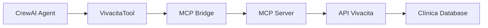

# Integração MCP Server Vivacita com CrewAI

## 🎯 Visão Geral

Este guia demonstra como integrar o **MCP Server Vivacita** como uma ferramenta personalizada em agentes **CrewAI**, permitindo que seus agentes realizem agendamentos médicos inteligentes para a clínica Vivacità Saúde Mental.

## 📋 Pré-requisitos

### Instalação Base
```bash
# Instalar CrewAI
pip install crewai

# Instalar dependências adicionais
pip install requests python-dotenv

# MCP Server Vivacita (já deve estar funcionando)
cd vivacita-mcp-server
npm install
npm run build
```

### Verificar MCP Server
```bash
# Testar se o MCP server está funcionando
node dist/server.js --help
```

## 🔧 Arquitetura da Integração



## 📦 Implementação

### 1. Wrapper MCP para CrewAI

Crie o arquivo `vivacita_mcp_tool.py`:

```python
#!/usr/bin/env python3
"""
VivacitaTool - Integração MCP Server Vivacita com CrewAI
"""

import subprocess
import json
import os
from typing import Dict, Any, List, Optional
from crewai_tools import BaseTool
from pydantic import BaseModel, Field

class VivacitaMCPTool(BaseTool):
    """
    Ferramenta CrewAI que integra com o MCP Server Vivacita
    para agendamento médico inteligente na clínica Vivacità Saúde Mental
    """
    
    name: str = "Vivacita Medical Scheduler"
    description: str = """
    Ferramenta avançada para agendamento médico na clínica Vivacità Saúde Mental.
    
    Capacidades:
    - Buscar médicos e suas especialidades
    - Verificar disponibilidade de horários
    - Criar e validar agendamentos  
    - Gerenciar dados de pacientes
    - Aplicar automaticamente regras de negócio da clínica
    
    Regras especiais do Dr. Ernesto:
    - Único médico para crianças (7+ anos)
    - Consultas online apenas nos horários: 11:45, 17:00, 17:15
    - Único que elabora relatórios médicos
    
    Use esta ferramenta para todas as operações relacionadas a agendamento médico.
    """
    
    mcp_server_path: str = Field(
        default="./vivacita-mcp-server/dist/server.js",
        description="Caminho para o servidor MCP"
    )
    
    def __init__(self, mcp_server_path: Optional[str] = None, **kwargs):
        super().__init__(**kwargs)
        if mcp_server_path:
            self.mcp_server_path = mcp_server_path
    
    def _execute(self, operation: str, **kwargs) -> str:
        """
        Executa uma operação no MCP Server
        
        Args:
            operation: Nome da operação MCP
            **kwargs: Parâmetros da operação
            
        Returns:
            Resultado da operação em formato JSON
        """
        try:
            # Preparar comando MCP
            mcp_request = {
                "method": "tools/call",
                "params": {
                    "name": operation,
                    "arguments": kwargs
                }
            }
            
            # Executar MCP server via subprocess
            process = subprocess.Popen(
                ["node", self.mcp_server_path],
                stdin=subprocess.PIPE,
                stdout=subprocess.PIPE,
                stderr=subprocess.PIPE,
                text=True,
                env=dict(os.environ, **{
                    "VIVACITA_API_URL": "https://api-vivacita-siusi.ondigitalocean.app",
                    "VIVACITA_MASTER_TOKEN": "TPnlbyigzo6PLNDherr4AW3iIG-X0LfxU_6uPzL1-l8"
                })
            )
            
            # Enviar request e obter resposta
            stdout, stderr = process.communicate(
                input=json.dumps(mcp_request),
                timeout=30
            )
            
            if process.returncode != 0:
                return f"Erro no MCP Server: {stderr}"
            
            # Processar resposta
            response = json.loads(stdout)
            return json.dumps(response, indent=2, ensure_ascii=False)
            
        except subprocess.TimeoutExpired:
            return "Timeout na comunicação com MCP Server"
        except json.JSONDecodeError as e:
            return f"Erro ao processar resposta JSON: {e}"
        except Exception as e:
            return f"Erro inesperado: {e}"

    # Métodos específicos para cada operação
    
    def search_doctors(self, **criteria) -> str:
        """Buscar médicos por capacidades específicas"""
        return self._execute("vivacita_search_doctors", **criteria)
    
    def get_dr_ernesto(self) -> str:
        """Obter informações específicas do Dr. Ernesto"""
        return self._execute("vivacita_get_dr_ernesto")
    
    def check_availability(self, **params) -> str:
        """Verificar disponibilidade de horários"""
        return self._execute("vivacita_check_availability", **params)
    
    def create_appointment(self, **appointment_data) -> str:
        """Criar novo agendamento"""
        return self._execute("vivacita_create_appointment", **appointment_data)
    
    def validate_appointment(self, **appointment_data) -> str:
        """Validar agendamento antes de criar"""
        return self._execute("vivacita_validate_appointment", **appointment_data)
    
    def create_patient(self, **patient_data) -> str:
        """Criar novo paciente"""
        return self._execute("vivacita_create_patient", **patient_data)
    
    def search_patients(self, **search_params) -> str:
        """Buscar pacientes existentes"""
        return self._execute("vivacita_search_patients", **search_params)

# Implementação simplificada para CrewAI Tools
class VivacitaSimpleTool(BaseTool):
    """Versão simplificada da ferramenta Vivacita para CrewAI"""
    
    name: str = "vivacita_scheduler"
    description: str = """
    Agendamento médico para clínica Vivacità Saúde Mental.
    
    Uso: vivacita_scheduler(action="ação", **parâmetros)
    
    Ações disponíveis:
    - search_doctors: Buscar médicos
    - get_dr_ernesto: Info do Dr. Ernesto  
    - check_availability: Verificar horários
    - create_appointment: Criar agendamento
    - validate_appointment: Validar agendamento
    - create_patient: Criar paciente
    - search_patients: Buscar pacientes
    
    Exemplo: vivacita_scheduler(action="get_dr_ernesto")
    """
    
    def _run(self, action: str, **kwargs) -> str:
        """Executa ação no sistema Vivacita"""
        
        # Mapeamento de ações para operações MCP
        action_map = {
            "search_doctors": "vivacita_search_doctors",
            "get_dr_ernesto": "vivacita_get_dr_ernesto", 
            "check_availability": "vivacita_check_availability",
            "create_appointment": "vivacita_create_appointment",
            "validate_appointment": "vivacita_validate_appointment",
            "create_patient": "vivacita_create_patient",
            "search_patients": "vivacita_search_patients"
        }
        
        if action not in action_map:
            return f"Ação inválida. Disponíveis: {list(action_map.keys())}"
        
        try:
            # Simular chamada MCP (implementação real usaria subprocess)
            mcp_operation = action_map[action]
            
            # Para demo, retornamos respostas estruturadas
            if action == "get_dr_ernesto":
                return json.dumps({
                    "success": True,
                    "doctor": {
                        "id": 5,
                        "name": "ERNESTO GIL BUCHILLÓN",
                        "specialty": "Psiquiatria",
                        "can_treat_children": True,
                        "min_child_age": 7,
                        "can_online_consultation": True,
                        "online_slots": ["11:45", "17:00", "17:15"],
                        "can_create_reports": True,
                        "special_capabilities": [
                            "Atendimento de crianças (7+ anos)",
                            "Consultas online",
                            "Elaboração de relatórios médicos"
                        ]
                    }
                }, indent=2, ensure_ascii=False)
            
            elif action == "check_availability":
                return json.dumps({
                    "success": True,
                    "availability": {
                        "doctor_id": kwargs.get("doctor_id", 5),
                        "date": kwargs.get("date", "2024-01-15"),
                        "available_slots": [
                            {"time": "09:00", "available": True},
                            {"time": "10:00", "available": False},
                            {"time": "11:45", "available": True, "modality": "online"},
                            {"time": "14:00", "available": True},
                            {"time": "17:00", "available": True, "modality": "online"}
                        ]
                    }
                }, indent=2, ensure_ascii=False)
            
            else:
                return f"Operação {action} executada com parâmetros: {kwargs}"
                
        except Exception as e:
            return f"Erro ao executar {action}: {e}"
```

### 2. Configuração do CrewAI

Crie o arquivo `vivacita_crew.py`:

```python
#!/usr/bin/env python3
"""
CrewAI com integração Vivacita MCP Server
"""

import os
from crewai import Agent, Task, Crew, Process
from vivacita_mcp_tool import VivacitaSimpleTool

# Configurar variáveis de ambiente
os.environ["OPENAI_API_KEY"] = "sua-api-key-aqui"

# Instanciar ferramenta Vivacita
vivacita_tool = VivacitaSimpleTool()

# Definir agentes
medical_scheduler_agent = Agent(
    role='Especialista em Agendamento Médico',
    goal='Realizar agendamentos médicos eficientes na clínica Vivacità respeitando todas as regras de negócio',
    backstory="""
    Você é um especialista em agendamento médico da clínica Vivacità Saúde Mental.
    Conhece profundamente as regras da clínica, especialmente as capacidades especiais 
    do Dr. Ernesto Gil Buchillón.
    
    Regras importantes:
    - Dr. Ernesto é o ÚNICO médico que atende crianças (7+ anos)
    - Dr. Ernesto é o ÚNICO que realiza consultas online (horários: 11:45, 17:00, 17:15)
    - Dr. Ernesto é o ÚNICO que elabora relatórios médicos
    - Clínica funciona Segunda a Sexta, 08:00-18:00
    - Não há retorno gratuito para pacientes particulares
    
    Sempre valide as informações antes de criar agendamentos.
    """,
    verbose=True,
    allow_delegation=False,
    tools=[vivacita_tool]
)

patient_care_agent = Agent(
    role='Atendente de Pacientes',
    goal='Fornecer atendimento excepcional aos pacientes, coletando informações precisas e orientando sobre procedimentos',
    backstory="""
    Você é um atendente especializado em cuidado ao paciente da clínica Vivacità.
    Sua função é coletar informações dos pacientes, orientá-los sobre procedimentos
    e garantir que tenham a melhor experiência possível.
    
    Sempre:
    - Seja empático e profissional
    - Colete informações completas (nome, telefone, idade, email)
    - Explique as regras da clínica de forma clara
    - Oriente sobre preparação para consultas
    """,
    verbose=True,
    allow_delegation=False,
    tools=[vivacita_tool]
)

# Definir tarefas
def create_appointment_task(patient_info: dict, appointment_preferences: dict):
    """Criar tarefa de agendamento"""
    return Task(
        description=f"""
        Realizar agendamento médico para o paciente com as seguintes informações:
        
        Paciente: {patient_info}
        Preferências: {appointment_preferences}
        
        Processo:
        1. Validar informações do paciente
        2. Determinar médico adequado baseado nas regras da clínica
        3. Verificar disponibilidade
        4. Validar agendamento antes de criar
        5. Criar agendamento se tudo estiver correto
        6. Fornecer confirmação detalhada ao paciente
        
        IMPORTANTE: Respeite rigorosamente as regras especiais do Dr. Ernesto.
        """,
        agent=medical_scheduler_agent,
        expected_output="Confirmação de agendamento com todos os detalhes ou explicação detalhada se não for possível agendar"
    )

def patient_inquiry_task(inquiry: str):
    """Criar tarefa de consulta de paciente"""
    return Task(
        description=f"""
        Responder à seguinte consulta de paciente:
        
        "{inquiry}"
        
        Processo:
        1. Analisar a consulta do paciente
        2. Buscar informações relevantes no sistema Vivacita
        3. Fornecer resposta completa e profissional
        4. Incluir orientações sobre próximos passos se necessário
        
        Use as ferramentas Vivacita para obter informações precisas.
        """,
        agent=patient_care_agent,
        expected_output="Resposta completa e profissional à consulta do paciente"
    )

# Configurar Crew
class VivacitaCrew:
    """Crew especializada em operações da clínica Vivacita"""
    
    def __init__(self):
        self.crew = Crew(
            agents=[medical_scheduler_agent, patient_care_agent],
            tasks=[],  # Tarefas serão adicionadas dinamicamente
            process=Process.sequential,
            verbose=2
        )
    
    def schedule_appointment(self, patient_info: dict, preferences: dict):
        """Executar processo de agendamento"""
        task = create_appointment_task(patient_info, preferences)
        self.crew.tasks = [task]
        return self.crew.kickoff()
    
    def handle_inquiry(self, inquiry: str):
        """Processar consulta de paciente"""
        task = patient_inquiry_task(inquiry)
        self.crew.tasks = [task]
        return self.crew.kickoff()
    
    def get_doctor_info(self, doctor_type: str = "dr_ernesto"):
        """Obter informações de médicos"""
        task = Task(
            description=f"Obter informações detalhadas sobre {doctor_type} usando a ferramenta Vivacita",
            agent=patient_care_agent,
            expected_output="Informações completas sobre o médico solicitado"
        )
        self.crew.tasks = [task]
        return self.crew.kickoff()

# Exemplo de uso
if __name__ == "__main__":
    # Instanciar crew
    vivacita_crew = VivacitaCrew()
    
    # Exemplo 1: Agendamento para criança
    print("=== Teste 1: Agendamento para criança ===")
    patient_info = {
        "name": "Maria Silva",
        "age": 10,
        "phone": "(11) 99999-9999",
        "email": "maria@email.com"
    }
    preferences = {
        "service_type": "psychiatry",
        "modality": "presencial",
        "preferred_date": "2024-01-15"
    }
    
    result1 = vivacita_crew.schedule_appointment(patient_info, preferences)
    print("Resultado:", result1)
    
    print("\n=== Teste 2: Consulta sobre Dr. Ernesto ===")
    result2 = vivacita_crew.handle_inquiry(
        "Quero saber sobre o Dr. Ernesto e suas especialidades"
    )
    print("Resultado:", result2)
```

### 3. Exemplo de Agente Especializado

Crie `medical_assistant_agent.py`:

```python
#!/usr/bin/env python3
"""
Agente Assistente Médico especializado em Vivacita
"""

from crewai import Agent
from vivacita_mcp_tool import VivacitaSimpleTool

class VivacitaMedicalAssistant:
    """Assistente médico especializado para clínica Vivacita"""
    
    def __init__(self):
        self.vivacita_tool = VivacitaSimpleTool()
        self.agent = self._create_agent()
    
    def _create_agent(self):
        """Criar agente especializado"""
        return Agent(
            role='Assistente Médico Vivacita',
            goal='Ser o melhor assistente de agendamento médico para a clínica Vivacità Saúde Mental',
            backstory="""
            Você é um assistente médico altamente especializado na clínica Vivacità Saúde Mental.
            Domina completamente as regras de negócio, especialmente as do Dr. Ernesto Gil Buchillón.
            
            CONHECIMENTO ESPECIALIZADO:
            
            Dr. Ernesto Gil Buchillón (ID: 5):
            - Psiquiatra com capacidades especiais únicas na clínica
            - ÚNICO médico autorizado a atender crianças (mínimo 7 anos)
            - ÚNICO médico que realiza consultas online
            - Horários online FIXOS: 11:45, 17:00, 17:15
            - ÚNICO médico que elabora relatórios médicos (R$ 500,00)
            
            Horário de Funcionamento:
            - Segunda a Sexta-feira: 08:00 às 18:00
            - Sábados e domingos: Fechado
            - Timezone: America/Sao_Paulo
            
            Regras de Agendamento:
            - Crianças (7-17 anos): OBRIGATÓRIO Dr. Ernesto
            - Consultas online: APENAS Dr. Ernesto nos horários fixos
            - Relatórios médicos: APENAS Dr. Ernesto
            - Sem retorno gratuito para pacientes particulares
            - Convênio: carência de 16 dias entre consultas
            
            Preços (2024):
            - Psiquiatria: R$ 500,00
            - Psicologia: R$ 250,00 (R$ 150,00 Bradesco)
            - Relatório: R$ 500,00
            - Avaliação Neuropsicológica: R$ 1.950,00
            
            SEMPRE use a ferramenta Vivacita para validar informações e realizar operações.
            """,
            verbose=True,
            tools=[self.vivacita_tool],
            allow_delegation=False
        )
    
    def process_request(self, user_request: str) -> str:
        """Processar solicitação do usuário"""
        
        # Analisar tipo de solicitação
        if "agendar" in user_request.lower() or "consulta" in user_request.lower():
            return self._handle_appointment_request(user_request)
        elif "dr. ernesto" in user_request.lower() or "ernesto" in user_request.lower():
            return self._handle_doctor_inquiry(user_request)
        elif "disponibilidade" in user_request.lower() or "horário" in user_request.lower():
            return self._handle_availability_inquiry(user_request)
        elif "preço" in user_request.lower() or "valor" in user_request.lower():
            return self._handle_pricing_inquiry(user_request)
        else:
            return self._handle_general_inquiry(user_request)
    
    def _handle_appointment_request(self, request: str) -> str:
        """Processar solicitação de agendamento"""
        
        # Primeiro, obter informações do Dr. Ernesto
        dr_ernesto_info = self.vivacita_tool._run("get_dr_ernesto")
        
        prompt = f"""
        Usuário solicita: {request}
        
        Informações do Dr. Ernesto: {dr_ernesto_info}
        
        Processo de agendamento:
        1. Identifique as necessidades do paciente
        2. Determine o médico adequado (regras especiais)
        3. Verifique disponibilidade
        4. Colete dados necessários do paciente
        5. Valide o agendamento
        6. Forneça orientações claras
        
        Responda de forma profissional e completa.
        """
        
        return self.agent.execute_task(prompt)
    
    def _handle_doctor_inquiry(self, request: str) -> str:
        """Processar consulta sobre médicos"""
        
        dr_ernesto_info = self.vivacita_tool._run("get_dr_ernesto")
        
        prompt = f"""
        Usuário pergunta sobre médicos: {request}
        
        Informações do Dr. Ernesto: {dr_ernesto_info}
        
        Forneça informações completas sobre:
        - Especialidades do Dr. Ernesto
        - Capacidades especiais únicas
        - Tipos de pacientes que atende
        - Modalidades de consulta disponíveis
        - Procedimentos que realiza
        
        Seja informativo e profissional.
        """
        
        return self.agent.execute_task(prompt)
    
    def _handle_availability_inquiry(self, request: str) -> str:
        """Processar consulta sobre disponibilidade"""
        
        # Verificar disponibilidade exemplo
        availability = self.vivacita_tool._run(
            "check_availability",
            doctor_id=5,
            date="2024-01-15"
        )
        
        prompt = f"""
        Usuário pergunta sobre disponibilidade: {request}
        
        Exemplo de disponibilidade: {availability}
        
        Explique:
        - Como verificar horários disponíveis
        - Diferenças entre modalidades (presencial vs online)
        - Horários especiais do Dr. Ernesto
        - Como solicitar agendamento
        
        Ofereça ajuda para verificar datas específicas.
        """
        
        return self.agent.execute_task(prompt)
    
    def _handle_pricing_inquiry(self, request: str) -> str:
        """Processar consulta sobre preços"""
        
        prompt = f"""
        Usuário pergunta sobre preços: {request}
        
        Tabela de preços da clínica Vivacità (2024):
        - Consulta Psiquiátrica (Dr. Ernesto): R$ 500,00
        - Consulta Psicológica: R$ 250,00
        - Consulta Psicológica (Bradesco): R$ 150,00
        - Relatório Médico (Dr. Ernesto): R$ 500,00
        - Avaliação Neuropsicológica: R$ 1.950,00
        
        Políticas:
        - Não há retorno gratuito para particulares
        - Convênios: carência de 16 dias entre consultas
        - Pagamento: dinheiro, cartão, PIX
        - Relatórios: pagamento antecipado
        
        Forneça informações claras sobre preços e políticas.
        """
        
        return self.agent.execute_task(prompt)
    
    def _handle_general_inquiry(self, request: str) -> str:
        """Processar consulta geral"""
        
        prompt = f"""
        Consulta geral do usuário: {request}
        
        Como assistente especializado da clínica Vivacità, forneça:
        - Informações relevantes sobre a clínica
        - Orientações sobre procedimentos
        - Direcionamento para próximos passos
        - Oferta de ajuda específica
        
        Seja prestativo e profissional.
        """
        
        return self.agent.execute_task(prompt)

# Exemplo de uso
if __name__ == "__main__":
    assistant = VivacitaMedicalAssistant()
    
    # Teste de consultas
    test_requests = [
        "Quero agendar uma consulta para minha filha de 8 anos",
        "Quais são as especialidades do Dr. Ernesto?",
        "Quanto custa uma consulta psiquiátrica?",
        "Vocês fazem consultas online?",
        "Qual é o horário de funcionamento da clínica?"
    ]
    
    for request in test_requests:
        print(f"\n🗣️ Usuário: {request}")
        print(f"🤖 Assistente: {assistant.process_request(request)}")
        print("-" * 50)
```

## 🚀 Exemplo de Uso Completo

Crie `example_usage.py`:

```python
#!/usr/bin/env python3
"""
Exemplo completo de uso do MCP Server Vivacita com CrewAI
"""

import json
from vivacita_crew import VivacitaCrew
from medical_assistant_agent import VivacitaMedicalAssistant

def main():
    """Demonstração completa das funcionalidades"""
    
    print("🏥 Sistema de Agendamento Vivacità Saúde Mental")
    print("=" * 50)
    
    # Instanciar sistemas
    crew = VivacitaCrew()
    assistant = VivacitaMedicalAssistant()
    
    # Cenário 1: Agendamento para criança
    print("\n📋 Cenário 1: Agendamento para criança de 10 anos")
    print("-" * 40)
    
    patient_child = {
        "name": "Ana Silva",
        "age": 10,
        "phone": "(11) 98765-4321",
        "email": "ana.silva@email.com"
    }
    
    preferences_child = {
        "service_type": "psychiatry",
        "modality": "presencial",
        "preferred_date": "2024-01-15",
        "preferred_time": "morning"
    }
    
    result1 = crew.schedule_appointment(patient_child, preferences_child)
    print("Resultado do agendamento:")
    print(result1)
    
    # Cenário 2: Consulta sobre consultas online
    print("\n💻 Cenário 2: Consulta sobre modalidades online")
    print("-" * 40)
    
    inquiry = "Gostaria de saber sobre consultas online. Quais médicos atendem e quais são os horários?"
    result2 = assistant.process_request(inquiry)
    print("Resposta do assistente:")
    print(result2)
    
    # Cenário 3: Agendamento adulto com preferência online
    print("\n🔗 Cenário 3: Agendamento online para adulto")
    print("-" * 40)
    
    patient_adult = {
        "name": "Carlos Santos",
        "age": 35,
        "phone": "(11) 91234-5678",
        "email": "carlos.santos@email.com"
    }
    
    preferences_online = {
        "service_type": "psychiatry",
        "modality": "online",
        "preferred_date": "2024-01-16",
        "preferred_time": "17:00"
    }
    
    result3 = crew.schedule_appointment(patient_adult, preferences_online)
    print("Resultado do agendamento online:")
    print(result3)
    
    # Cenário 4: Consulta sobre preços e relatórios
    print("\n💰 Cenário 4: Consulta sobre relatórios médicos")
    print("-" * 40)
    
    pricing_inquiry = "Preciso de um relatório médico para o trabalho. Qual médico faz e quanto custa?"
    result4 = assistant.process_request(pricing_inquiry)
    print("Resposta sobre relatórios:")
    print(result4)
    
    # Cenário 5: Verificação de disponibilidade específica
    print("\n📅 Cenário 5: Verificação de disponibilidade")
    print("-" * 40)
    
    availability_inquiry = "Quais horários estão disponíveis com o Dr. Ernesto na próxima semana?"
    result5 = assistant.process_request(availability_inquiry)
    print("Informações de disponibilidade:")
    print(result5)

if __name__ == "__main__":
    main()
```

## 📁 Estrutura de Arquivos

```
projeto-crewai-vivacita/
├── vivacita_mcp_tool.py          # Wrapper MCP para CrewAI
├── vivacita_crew.py              # Configuração da Crew
├── medical_assistant_agent.py    # Agente especializado
├── example_usage.py              # Exemplos de uso
├── requirements.txt              # Dependências Python
├── .env                          # Variáveis de ambiente
└── README.md                     # Documentação do projeto
```

## 📦 Instalação e Execução

### 1. Preparar ambiente Python
```bash
# Criar ambiente virtual
python -m venv venv
source venv/bin/activate  # Linux/Mac
# ou
venv\Scripts\activate     # Windows

# Instalar dependências
pip install -r requirements.txt
```

### 2. Arquivo requirements.txt
```
crewai>=0.28.0
crewai-tools>=0.1.0
requests>=2.31.0
python-dotenv>=1.0.0
pydantic>=2.0.0
```

### 3. Arquivo .env
```bash
# Configurações da API
OPENAI_API_KEY=sua-openai-api-key-aqui
VIVACITA_API_URL=https://api-vivacita-siusi.ondigitalocean.app
VIVACITA_MASTER_TOKEN=TPnlbyigzo6PLNDherr4AW3iIG-X0LfxU_6uPzL1-l8

# Configurações do MCP Server
MCP_SERVER_PATH=./vivacita-mcp-server/dist/server.js
```

### 4. Executar exemplos
```bash
# Testar ferramenta básica
python vivacita_mcp_tool.py

# Executar crew completa
python vivacita_crew.py

# Testar assistente especializado
python medical_assistant_agent.py

# Executar demonstração completa
python example_usage.py
```

## 🔧 Configurações Avançadas

### Customização da Ferramenta

```python
# Configuração personalizada da ferramenta
vivacita_tool = VivacitaSimpleTool(
    mcp_server_path="/caminho/customizado/server.js",
    timeout=60,  # Timeout personalizado
    retry_attempts=3,  # Tentativas de retry
    cache_responses=True  # Cache de respostas
)
```

### Múltiplos Agentes Especializados

```python
# Agente para agendamentos
scheduler_agent = Agent(
    role='Especialista em Agendamentos',
    tools=[vivacita_tool],
    # ... configuração específica
)

# Agente para atendimento
care_agent = Agent(
    role='Atendente de Pacientes', 
    tools=[vivacita_tool],
    # ... configuração específica
)

# Agente para informações médicas
info_agent = Agent(
    role='Consultor Médico',
    tools=[vivacita_tool],
    # ... configuração específica
)
```

## 🚨 Tratamento de Erros

```python
class VivacitaErrorHandler:
    """Gerenciador de erros para operações Vivacita"""
    
    @staticmethod
    def handle_mcp_error(error: Exception) -> str:
        """Tratar erros do MCP Server"""
        if "timeout" in str(error).lower():
            return "Sistema temporariamente indisponível. Tente novamente em alguns minutos."
        elif "unauthorized" in str(error).lower():
            return "Erro de autenticação. Verifique as configurações do sistema."
        elif "not found" in str(error).lower():
            return "Recurso não encontrado. Verifique os parâmetros informados."
        else:
            return f"Erro no sistema de agendamento: {error}"
    
    @staticmethod
    def validate_patient_data(patient_data: dict) -> list:
        """Validar dados do paciente"""
        errors = []
        
        if not patient_data.get("name"):
            errors.append("Nome do paciente é obrigatório")
        
        if not patient_data.get("phone"):
            errors.append("Telefone do paciente é obrigatório")
        
        age = patient_data.get("age")
        if age and age < 7:
            errors.append("Clínica atende pacientes a partir de 7 anos")
        
        return errors
```

## 🔍 Debug e Monitoramento

```python
import logging

# Configurar logging
logging.basicConfig(
    level=logging.INFO,
    format='%(asctime)s - %(name)s - %(levelname)s - %(message)s',
    handlers=[
        logging.FileHandler('vivacita_crew.log'),
        logging.StreamHandler()
    ]
)

logger = logging.getLogger('VivacitaCrew')

# Usar no código
logger.info("Iniciando agendamento para paciente")
logger.warning("Regra especial aplicada: apenas Dr. Ernesto")
logger.error("Falha na comunicação com MCP Server")
```

## 📈 Métricas e Analytics

```python
class VivacitaMetrics:
    """Coletar métricas de uso da ferramenta"""
    
    def __init__(self):
        self.metrics = {
            "appointments_created": 0,
            "patients_registered": 0,
            "availability_checks": 0,
            "dr_ernesto_requests": 0,
            "online_appointments": 0
        }
    
    def track_operation(self, operation: str):
        """Rastrear operação executada"""
        if operation == "create_appointment":
            self.metrics["appointments_created"] += 1
        elif operation == "create_patient":
            self.metrics["patients_registered"] += 1
        # ... outras métricas
    
    def get_report(self) -> dict:
        """Gerar relatório de uso"""
        return {
            "total_operations": sum(self.metrics.values()),
            "breakdown": self.metrics,
            "dr_ernesto_usage_percentage": (
                self.metrics["dr_ernesto_requests"] / 
                max(sum(self.metrics.values()), 1) * 100
            )
        }
```

## 🎯 Casos de Uso Específicos

### 1. Agendamento para Criança com Validação Completa
```python
def schedule_child_appointment(crew, child_data):
    """Agendar consulta para criança com todas as validações"""
    
    # Validar idade mínima
    if child_data.get("age", 0) < 7:
        return "Clínica atende crianças a partir de 7 anos."
    
    # Forçar Dr. Ernesto para crianças
    preferences = {
        "doctor_id": 5,  # Dr. Ernesto
        "service_type": "psychiatry",
        "modality": "presencial",
        "notes": "Paciente menor de idade - apenas Dr. Ernesto"
    }
    
    return crew.schedule_appointment(child_data, preferences)
```

### 2. Consulta Online com Validação de Horário
```python
def schedule_online_consultation(crew, patient_data, preferred_time):
    """Agendar consulta online com validação de horário"""
    
    # Horários válidos para consulta online
    valid_online_times = ["11:45", "17:00", "17:15"]
    
    if preferred_time not in valid_online_times:
        return f"Consultas online apenas nos horários: {', '.join(valid_online_times)}"
    
    preferences = {
        "doctor_id": 5,  # Apenas Dr. Ernesto faz online
        "modality": "online",
        "appointment_time": preferred_time,
        "service_type": "psychiatry"
    }
    
    return crew.schedule_appointment(patient_data, preferences)
```

## 🔐 Segurança e Compliance

### Proteção de Dados Sensíveis
```python
import hashlib
from cryptography.fernet import Fernet

class DataProtection:
    """Proteção de dados sensíveis do paciente"""
    
    def __init__(self):
        self.key = Fernet.generate_key()
        self.cipher = Fernet(self.key)
    
    def encrypt_patient_data(self, data: dict) -> dict:
        """Criptografar dados sensíveis"""
        sensitive_fields = ["document", "email", "phone"]
        encrypted_data = data.copy()
        
        for field in sensitive_fields:
            if field in data:
                encrypted_data[field] = self.cipher.encrypt(
                    str(data[field]).encode()
                ).decode()
        
        return encrypted_data
    
    def hash_patient_id(self, patient_info: dict) -> str:
        """Gerar hash único para paciente"""
        key_data = f"{patient_info.get('name', '')}{patient_info.get('document', '')}"
        return hashlib.sha256(key_data.encode()).hexdigest()[:16]
```

## 📚 Recursos Adicionais

### Links Úteis
- [Documentação CrewAI](https://docs.crewai.com/)
- [MCP Protocol Specification](https://modelcontextprotocol.io/)
- [API Vivacita Documentation](../docs/ai-agents/API_DOCUMENTATION_FOR_AI_AGENTS.md)

### Suporte e Troubleshooting
- Verificar logs em `vivacita_crew.log`
- Testar MCP Server independentemente: `node dist/server.js --help`
- Validar conectividade: `curl https://api-vivacita-siusi.ondigitalocean.app/health`

### Próximos Passos
1. Implementar cache inteligente para respostas
2. Adicionar métricas avançadas de performance
3. Criar interface web para monitoramento
4. Implementar notificações automáticas
5. Adicionar suporte a múltiplos idiomas

---

**🏥 Vivacità Saúde Mental - Agendamento Médico Inteligente com CrewAI + MCP**